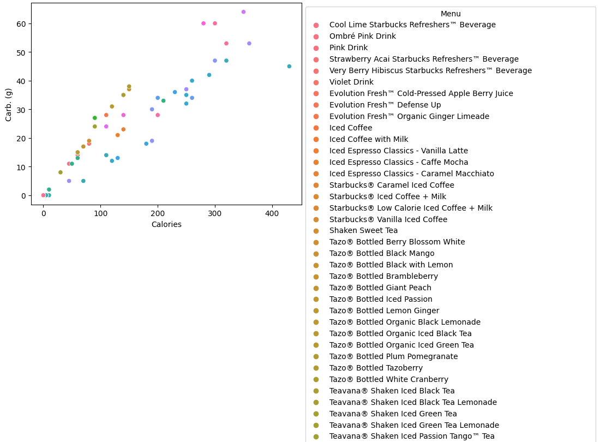
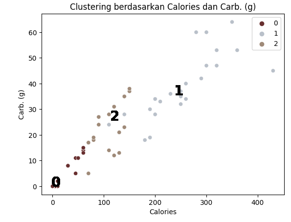

# Laporan Proyek Machine Learning

### Nama : Salma Aulia

### Nim : 211351134

### Kelas : TIF Pagi A

## Domain Proyek


Starbuck adalah suatu perusahaan bisnis yang berfokus pada penjualan minuman. Dengan jumlah pelanggan yang sangat banyak di seluruh dunia, maka kita harus memahami bagaimana kandungan-kandungan yang terdapat pada menu mereka. Namun setelah mengetahui kandungan dari menu-menu mereka, kita masih kebingungan untuk memilih apakah menu tersebut termasuk sehat atau bahkan berbahaya bagi kesehatan jika dikonsumsi terus meneurs. Salah satu upaya yang dapat dilakukan dari permasalahan tersebut adalah dengan melakukan pengtelompokkan atau clustering pada masing-masing menu. Setelah melakukan pengelompokkan, kita dapat mengetahui menu-menu mana saja yang termasuk aman jika dikonsumsi secara terus menerus, dan menu-menu mana saja yang tidak aman untuk dikonsumsi secara terus menerus. Dengan begitu kita dapat memilih menu yang sesuai dengan kondisi tubuh kita masing-masing.

## Business Understanding

### Problem Statements

- Kita perlu memilih menu mana saja yang sesuai dengan kondisi tubuh kita
- Kita perlu mengelompokkan menu-menu pada Starbucks sesuai dengan kandungannya.

### Goals

- Pengelompokkan menu minuman Starbucks berdasarkan kandungannya.

### Solution statements

- Membangun suatu sistem yang dapat mempelajari data menu minuman Starbucks untuk dilakukan clustering data.
- Sistem berjalan dengan menggunakan metode K Means yang dinilai cocok untuk melakukan clustering.

## Data Understanding

Dataset yang digunakan berasal dari situs Kaggle. Dataset ini mengandung 177 entries dan 7 columns<br>

Link Dataset: [Starbucks Nutrition Facts](https://www.kaggle.com/datasets/starbucks/starbucks-menu).

### Variabel-variabel yang terdapat pada Dataset adalah sebagai berikut:

- Menu = Nama menu tersebut.
- Calories = jumlah kalori pada menu tersebut.
- Fat (g) = jumlah lemak pada menu tersebut.
- Carb. (g) = jumlah carbohidrat pada menu tersebut.
- Fiber (g) = jumlah serat pada menu tersebut.
- Protein = jumlah protein pada menu tersebut.
- Sodium = jumlah sodium pada menu tersebut.

## Exploratory Data Analyst (EDA)

### Nilai Sodium dan Calories pada Masing-masing Menu


Dari grafik diatas bisa ita lihat bahwa Menu Cinnamon Dolce Frapppucino adalah menu yang memiliki kandungan kalori dan sodium terbesar.

### Nilai Carbohidrat dan Calories pada Masing-masing Menu


Dari grafik diatas bisa ita lihat bahwa Menu Cafe Vanila Frapppucino adalah menu yang memiliki kandungan kalori dan sodium terbesar

### Perbandingan Kandungan Sodium dan Calories pada Minuman


Dari data diatas kita melihat bahwa semakin besar nilai calories maka semakin besar pula nilai sodium pada menu.

### Perbandingan Kandungan Carbohidrat dan Calories pada Minuman


Dari data diatas kita melihat bahwa semakin besar nilai calories maka semakin besar pula nilai Carbohidrat pada menu mesikpun grafik tidak menunjukkan garis linear.

### Persebaran Data Calories


Dari data diatas kita melihat bahwa nilai calories antara 0-50 gram memiliki kepadatan/jumlah data yang paling banyak.

## Data Preparation

Pertama-tama import semua library yang dibutuhkan,

```bash
import pandas as pd
import matplotlib.pyplot as plt
import seaborn as sns
from sklearn.cluster import KMeans
```

Setelah itu kita akan men-definsikan dataset menggunakan fungsi pada library pandas

```bash
df = pd.read_csv('/content/starbucks-menu-nutrition-drinks.csv')
```

Lalu kita akan melihat informasi mengenai dataset dengan syntax seperti dibawah:

```bash
df.info()
```

Dengan hasil sebagai berikut:

```bash
<class 'pandas.core.frame.DataFrame'>
RangeIndex: 177 entries, 0 to 176
Data columns (total 7 columns):
 #   Column     Non-Null Count  Dtype
---  ------     --------------  -----
 0   Menu       177 non-null    object
 1   Calories   177 non-null    object
 2   Fat (g)    177 non-null    object
 3   Carb. (g)  177 non-null    object
 4   Fiber (g)  177 non-null    object
 5   Protein    177 non-null    object
 6   Sodium     177 non-null    object
dtypes: object(7)
memory usage: 9.8+ KB
```

<br>

Selanjutnya memeriksa apakah ada data yang berisi nilai null pada dataset:

```bash
df.isna().sum()
```

Dengan hasil sebagai berikut:

```bash
Menu         0
Calories     0
Fat (g)      0
Carb. (g)    0
Fiber (g)    0
Protein      0
Sodium       0
dtype: int64
```

#### Merubah Seluruh Kolom Menjadi numerik

Jika kita lihat pada dataset, kita menemukan bahwa terdapat karakter "-" pada setiap kolom yang menunjukkan bahwa tidak adanya kandungan pada dataset tersebut. Kita akan merubah karakter tersebut menjadi angka 0 agar seluruh data bersifat numerik.

```bash
df['Calories'] = df['Calories'].str.replace('-','0')
df['Fat (g)'] = df['Fat (g)'].str.replace('-','0')
df['Carb. (g)'] = df['Carb. (g)'].str.replace('-','0')
df['Fiber (g)'] = df['Fiber (g)'].str.replace('-','0')
df['Protein'] = df['Protein'].str.replace('-','0')
df['Sodium'] = df['Sodium'].str.replace('-','0')

df['Calories'] = pd.to_numeric(df['Calories'])
df['Fat (g)'] = pd.to_numeric(df['Fat (g)'])
df['Carb. (g)'] = pd.to_numeric(df['Carb. (g)'])
df['Fiber (g)'] = pd.to_numeric(df['Fiber (g)'])
df['Protein'] = pd.to_numeric(df['Protein'])
df['Sodium'] = pd.to_numeric(df['Sodium'])
```

### Membuat feature

Setelah seluruh kolom bertipe data numerik, maka kita dapat membuat fitur dari kolom-kolom tersebut.
Feature digunakan sebagai parameter menghitung hasil clustering yang diharapkan. Untuk membuat feature dan target dengan codingan sbgai berikut:

```bash
x = df.drop(['Menu','Fat (g)','Fiber (g)','Protein'], axis=1)
```

Kita akan menggunakan kolom Sodium, Calories, dan Carb. (g) saja untuk dijadikan feature model kita.

## Modeling

Tahap pemodelan menggunakan teknik clustering KMeans. Untuk membuat metode clustering yang baik, kita perlu menemukan elbow point yang baik yang akan memberikan hasil clustering yang baik.

```bash
clusters=[]
for i in range(1,11):
  kmeans = KMeans(n_clusters=i).fit(x)
  clusters.append(kmeans.inertia_)

fig,ax=plt.subplots(figsize=(12,8))
sns.lineplot(x=list(range(1,11)), y=clusters, ax=ax)
ax.set_title('mencari elbow')
ax.set_xlabel('clusters')
ax.set_xlabel('inertia')
```


Dari data yang tertera, dapat dilihat bahwa elbow point berada dengan tepat pada titik inertia 2 dan 3. Oleh karena itu, jumlah cluster dapat dipilih antara 2 dan 3.

Selanjutnya, kita akan mengembangkan dan menerapkan algoritma KMeans pada dataset x yang telah disiapkan sebelumnya. Eksperimen akan dilakukan dengan mencoba membentuk cluster menggunakan jumlah cluster sebanyak 3.

```bash
n_clust = 3
kmean = KMeans(n_clusters=n_clust).fit(x)
x['Labels'] = kmean.labels_
```

Setelah melakukan modelling, kita akan mendapatkan kolom baru pada dataset x kita, yaitu kolom labels yang memuat label/cluster dari data tersebut. Kita mendapatkan 3 cluster dengan rata-rata nilai sebagai berikut:

```bash
Labels	Calories	Carb. (g)	Sodium
0	    6.5	        1.4	        1.8
1	    246.4	    37.0	    148.0
2	    120.8	    27.1	    24.8
```

Pada hasil clustering dapat kita simbulkan bahwa:

- Cluster 0 adalah minuman dengan nilai kalori, carbo, dan sodium rendah
- Cluster 1 adalah minuman dengan nilai kalori, carbo, dan sodium tinggi
- Cluster 2 adalah minuman dengan nilai kalori, carbo, dan sodium sedang

### Visualisasi Model

Kita akan melihat salah satu hasil dari model clustering kita sebagai berikut:




Kita juga akan melihat distribusi dari hasil clustering kita, sebagai berikut:

Pada data diatas kita melihat bahwa label 0 memiliki jumlah data terbanyak, sehingga menu minuman pada dataset ini ternyata mayoritas rendah kalori, sodium, dan karbohidrat

## Evaluation

Untuk mengevaluasi model clustering kita, kita akan memanfaatkan metode bernama Silhouette Score. Metode ini sebenarnya mirip dengan mencari elbow point yang bertujuan untuk menentukan jumlah cluster yang optimal untuk data kita. Evaluasi akan dilakukan untuk melihat apakah penggunaan 3 cluster sudah memadai atau mungkin terdapat jumlah cluster yang lebih optimal untuk data kita.

```bash
from sklearn.metrics import silhouette_score
import warnings
warnings.filterwarnings("ignore")

# Silhouette analysis
range_n_clusters = [2, 3, 4]

for num_clusters in range_n_clusters:

    # intialise kmeans
    kmeans = KMeans(n_clusters=num_clusters, max_iter=50)
    kmeans.fit(x_test)

    cluster_labels = kmeans.labels_

    # silhouette score
    silhouette_avg = silhouette_score(x_test, cluster_labels)
    print("For n_clusters={0}, the silhouette score is {1}".format(num_clusters, silhouette_avg))
```

Dari kode diatas kita dapat melihat hasil sebagai berikut:

```bash
For n_clusters=2, the silhouette score is 0.6936415932980083
For n_clusters=3, the silhouette score is 0.7246404264454266
For n_clusters=4, the silhouette score is 0.7240536389059937
```

Jumlah cluster sebanyak 3 ternyata memiliki skor tertinggi, yakni 0.7246404264454266, menunjukkan bahwa model kita berhasil beroperasi dengan baik menggunakan 3 cluster.

## Deployment

Link Streamlit:
